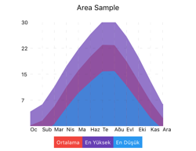
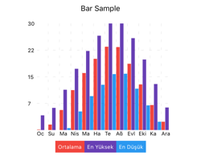
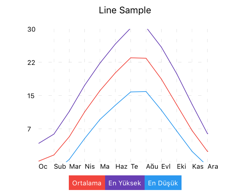
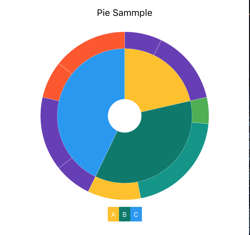
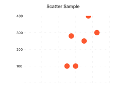

# Native Charts

With native-charts components, you can transform your data into graphs in your react-native applications.

## Installation

```
npm install --save native-charts
```

## Samples Charts







## AreaChart Usage

```js
import {AreaChart} from "native-charts";
...

let data = [
    {name: "A", public: 4000, private: 2400, protected: 2400},
    {name: "B", public: 3000, private: 1398, protected: 2210},
    {name: "C", public: 2000, private: 9800, protected: 2290},
    ...
];

let meta = [
    {dataKey: "public", name: "Public",  fill: "#F44336"},
    {dataKey: "private", name: "Private",  fill: "red"},
    {dataKey: "protected", name: "Protected", fill: "blue"}
];
...

<AreaChart data={data} meta={meta}/>

```

## BarChart Usage


```js
import {BarChart} from "native-charts";
...

let data = [
    {name: "A", public: 4000, private: 2400, protected: 2400},
    {name: "B", public: 3000, private: 1398, protected: 2210},
    {name: "C", public: 2000, private: 9800, protected: 2290},
    ...
];

let meta = [
    {dataKey: "public", name: "Public", fill: "blue"},
    {dataKey: "private", name: "Private", fill:"#F44336"},
    {dataKey: "protected", name: "Protected", fill: "red"}
];
...

<BarChart data={data} meta={meta}/>

```

## LineChart Usage


```js
import {LineChart} from "native-charts";
...

let data = [
    {name: "A", public: 4000, private: 2400, protected: 2400},
    {name: "B", public: 3000, private: 1398, protected: 2210},
    {name: "C", public: 2000, private: 9800, protected: 2290},
    ...
];

let meta = [
    {dataKey: "public", name: "Public", fill:"red"},
    {dataKey: "private", name: "Private", fill:"blue"},
    {dataKey: "protected", name: "Protected", fill:"yellow"}
];
...

<LineChart data={data} meta={meta}/>

```

## ScatterChart Usage


```js
import {ScatterChart} from "native-charts";
...

const dataA = [
    {x: 100, y: 200, z: 200},
    {x: 120, y: 100, z: 260},
    {x: 170, y: 300, z: 400},
    {x: 140, y: 250, z: 280},
    {x: 150, y: 400, z: 500},
    {x: 110, y: 280, z: 200},
    {x: 100, y: 200, z: 200},
    {x: 120, y: 100, z: 260},
    {x: 170, y: 300, z: 400},
    {x: 140, y: 250, z: 280},
    {x: 150, y: 400, z: 500},
    {x: 110, y: 280, z: 200}
];


let meta = [
    {dataKey: "x",  name: "X", fill:"#F44336"},
    {dataKey: "y",  name: "Y", fill:"red"},
    {dataKey: "z",  name: "Z", fill:"blue"}
];

...

<ScatterChart data={data}/>

```

## PieChart Usage

```js
import {PieChart} from "native-charts";
...

let data = [
    {
        value: 1500,
        label: "A",
        key: "0",
        fill:"#2196F3",
        children:[
                {
                    value: 2500,
                    label: "A1",
                    key: "11",
                    fill:"#F44336"
                },
                {
                    value: 3000,
                    label: "A2",
                    key: "12",
                    fill:"red"
                }
        ]
    },
    {
        value: 2500,
        label: "B",
        key: "1",
        fill:"#F44336"
    },
    {
        value: 3000,
        label: "C",
        key: "3",
        fill:"red"
    }
];

...

<PieChart data={data}/>

```

### Chart Props 

| Name | Type | Default | Required |
|------|------|---------|----------|
| data | array | - | false |
| meta | array | - | false |
| title | string | - | false |

#### Data Props 

| Name | Type | Default | Required |
|------|------|---------|----------|
| name | string | - | true |
| * | number | - | false |

#### Meta Props 

| Name | Type | Default | Required |
|------|------|---------|----------|
| dataKey | string | - | false |
| name | string | - | false |
| fill | string | - | false |